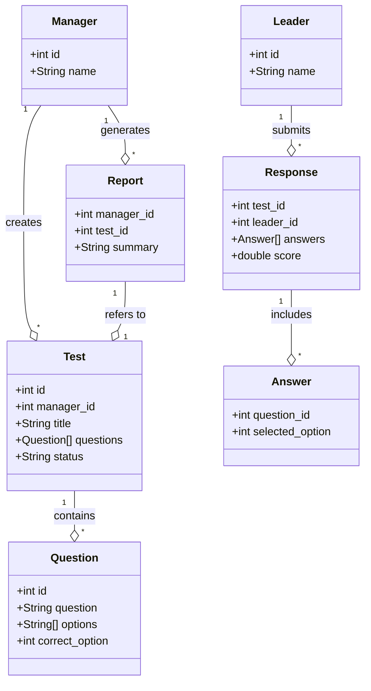

# Bradesco - Java Cloud Native 2025
Java API RESTful criada para o desafio do Bootcamp Bradesco - Java Cloud Native 2025

## Diagrama de Classes

```mermaid
classDiagram
    class Leader {
        +int id
        +String name
    }
    
    class Manager {
        +int id
        +String name
    }
    
    class Test {
        +int id
        +int manager_id
        +String title
        +Question[] questions
        +String status
    }
    
    class Question {
        +int id
        +String question
        +String[] options
        +int correct_option
    }
    
    class Response {
        +int test_id
        +int leader_id
        +Answer[] answers
        +double score
    }
    
    class Answer {
        +int question_id
        +int selected_option
    }
    
    class Report {
        +int manager_id
        +int test_id
        +String summary
    }
    
    Leader "1" --o "*" Response : submits
    Manager "1" --o "*" Test : creates
    Test "1" --o "*" Question : contains
    Response "1" --o "*" Answer : includes
    Manager "1" --o "*" Report : generates
    Report "1" --o "1" Test : refers to
```
